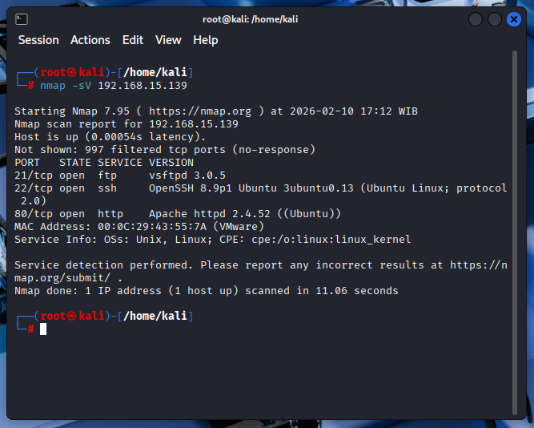

# 🛡️ Wazuh Home Lab – SSH Brute Force Detection

## 📌 Deskripsi
Proyek ini merupakan simulasi **home lab keamanan** menggunakan **Wazuh**  
untuk mendeteksi serangan **SSH brute force** pada server Linux.

Lab ini dirancang untuk menunjukkan bagaimana serangan berbasis kredensial
dapat terdeteksi melalui **host-based intrusion detection**.

---

## 🧱 Arsitektur Lab

| VM | Peran | OS |
|----|------|----|
| VM 1 | Wazuh Manager | Ubuntu |
| VM 2 | Attacker | Kali Linux |
| VM 3 | Target + Wazuh Agent | Ubuntu Server |

---

## 🔍 Skenario Serangan
1. Attacker melakukan scanning service menggunakan Nmap
2. Ditemukan service SSH terbuka
3. Attacker menjalankan SSH brute force
4. Target mencatat kegagalan login pada `auth.log`
5. Wazuh Agent mengirim event ke Manager
6. Alert muncul di dashboard Wazuh

---

## ⚔️ Simulasi Attacker

### Nmap Version Scanning

### SSH Brute Force

---

## 🚨 Detection & Alert
Wazuh mendeteksi:
- Multiple SSH login failure
- Attempt login menggunakan user tidak valid
- Korelasi event autentikasi

Detail analisis dapat dilihat di:
📄 [`docs/detection-analysis.md`](docs/detection-analysis.md)

---

## 🧠 Kesimpulan
- SSH brute force dapat terdeteksi tanpa exploit
- Log autentikasi merupakan indikator penting
- Wazuh efektif untuk monitoring endpoint

---

## 🛠️ Tools
- Wazuh
- Nmap
- OpenSSH
- Kali Linux
- Ubuntu Server
