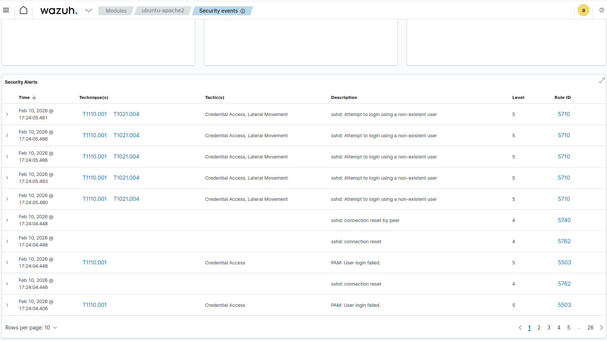
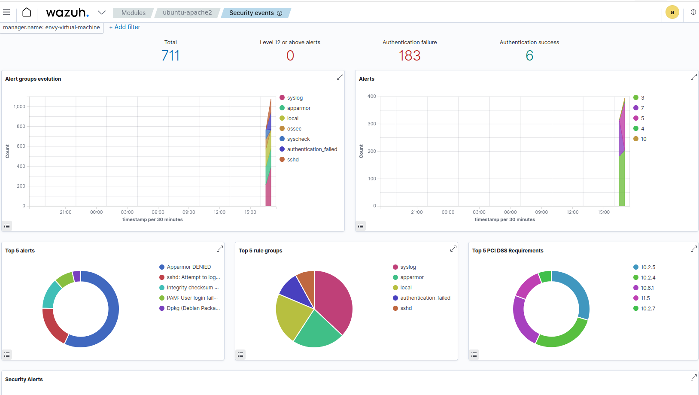

# Detection Analysis – Wazuh SSH Brute Force Alert

## 📊 Overview
Setelah simulasi serangan **SSH brute force** dijalankan,
Wazuh Agent berhasil mendeteksi aktivitas mencurigakan
berdasarkan log autentikasi pada server target.

Deteksi ini bersifat **host-based detection**,
di mana analisis dilakukan dari sisi endpoint (server),
bukan dari pemantauan lalu lintas jaringan.

---

## 🧾 Log Source
Deteksi berasal dari sumber log berikut:

- File log: `/var/log/auth.log`
- Service: OpenSSH
- Jenis event:
  - Failed password
  - PAM authentication failure
  - Percobaan login berulang dalam waktu singkat

---

## 🚨 Perilaku Alert
Selama simulasi berlangsung, Wazuh menghasilkan alert dengan karakteristik:

- Banyak alert muncul dalam waktu singkat
- Berasal dari **satu IP source yang sama**
- Menargetkan user yang berbeda atau user yang sama secara berulang

Alert dipicu setelah jumlah percobaan login gagal melewati ambang batas yang ditentukan oleh rule Wazuh.

---

## 🧠 Logika Deteksi
Wazuh mendeteksi aktivitas brute force berdasarkan:

- Pola login gagal yang berulang
- Frekuensi event autentikasi yang tidak normal
- Korelasi antar event SSH dan PAM authentication

Hal ini menunjukkan bahwa Wazuh tidak hanya membaca satu log,
tetapi melakukan **korelasi event** untuk mengidentifikasi serangan.

---

## 📈 Severity & Risiko
Alert yang dihasilkan memiliki tingkat severity **menengah hingga tinggi** karena:

- Berpotensi menyebabkan kompromi kredensial
- Menunjukkan aktivitas reconnaissance terhadap service SSH
- Umumnya digunakan sebagai tahap awal sebelum serangan lanjutan

---

## 🧩 Insight Analisis
Beberapa insight penting dari simulasi ini:

- Serangan brute force tidak memerlukan exploit untuk terdeteksi
- Log autentikasi sudah cukup kuat sebagai indikator serangan
- Monitoring SSH merupakan kontrol keamanan dasar yang sangat krusial

---

## 📌 Kesimpulan
Dari simulasi ini dapat disimpulkan bahwa Wazuh efektif dalam:

- Mendeteksi serangan berbasis kredensial (SSH brute force)
- Memberikan visibilitas aktivitas mencurigakan di sisi host
- Membantu analis SOC memahami pola dan timeline serangan

---

## 🖥️ Hasil Deteksi Wazuh

### Security Events
Tampilan ini menunjukkan alert mentah (raw events) yang dihasilkan Wazuh
berdasarkan kegagalan autentikasi SSH.

### Dashboard
Dashboard memberikan gambaran tingkat tinggi dari perspektif SOC,
menampilkan lonjakan authentication failure dan distribusi alert.

